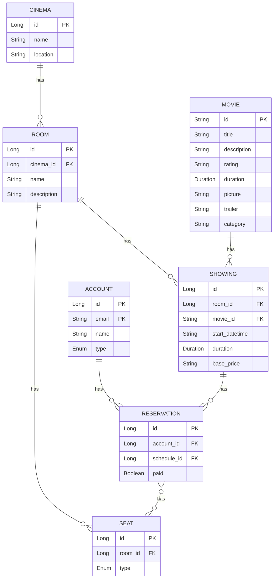

# ER Diagram

```mermaid
erDiagram
    CINEMA ||--o{ ROOM : has
    ROOM ||--o{ SEAT : has
    RESERVATION }o--o{ SEAT : has
    MOVIE ||--o{ SHOWING : has
    ROOM ||--o{ SHOWING : has
    SHOWING ||--o{ RESERVATION : has
    ACCOUNT ||--o{ RESERVATION : has  
    
    CINEMA {
        Long id PK
        
        String name
        String location
    }
    
    ROOM {
        Long id PK
        Long cinema_id FK
        
        String name
        String description
    }
    
    SEAT {
        Long id PK
        Long room_id FK
        
        Enum type
    }
    
    MOVIE {
        String id PK
        
        String title
        String description
        String rating
        Duration duration
        String picture
        String trailer
        String category
    }
    
    SHOWING {
        Long id PK
        Long room_id FK
        String movie_id FK
        
        String start_datetime
        Duration duration
        String base_price
    }
    
    RESERVATION {
        Long id PK
        Long account_id FK
        Long schedule_id FK
        
        Boolean paid
    }
    
    ACCOUNT {
        Long id PK
        String email PK
        
        String name
        Enum type
    }

```
