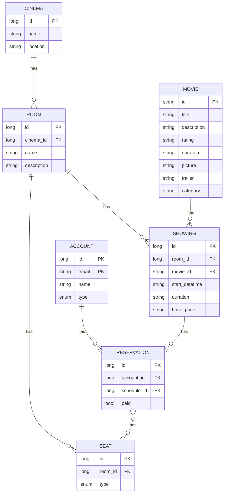

# ER Diagram

```mermaid
erDiagram
    CINEMA ||--o{ ROOM : has
    ROOM ||--o{ SEAT : has
    RESERVATION }o--o{ SEAT : has
    MOVIE ||--o{ SHOWING : has
    ROOM ||--o{ SHOWING : has
    SHOWING ||--o{ RESERVATION : has
    ACCOUNT ||--o{ RESERVATION : has  
    
    CINEMA {
        long id PK
        
        string name
        string location
    }
    
    ROOM {
        long id PK
        long cinema_id FK
        
        string name
        string description
    }
    
    SEAT {
        long id PK
        long room_id FK
        
        enum type
    }
    
    MOVIE {
        string id PK
        
        string title
        string description
        string rating
        string duration
        string picture
        string trailer
        string category
    }
    
    SHOWING {
        long id PK
        long room_id FK
        string movie_id FK
        
        string start_datetime
        string duration
        string base_price
    }
    
    RESERVATION {
        long id PK
        long account_id FK
        long schedule_id FK
        
        bool paid
    }
    
    ACCOUNT {
        long id PK
        string email PK
        
        string name
        enum type
    }

```
