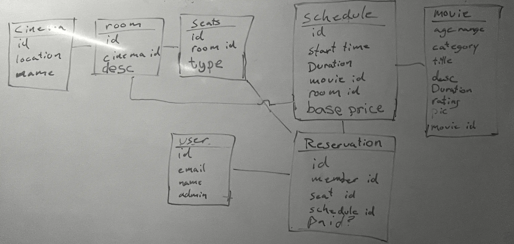
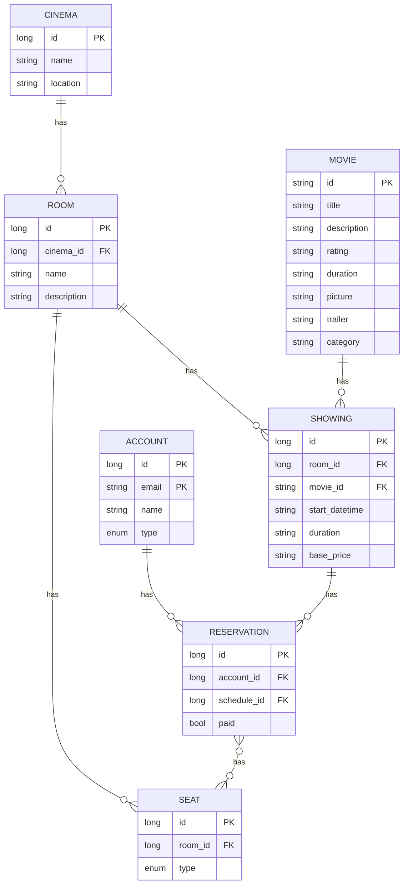

# Sprint Plan

## Sprint #1 (W18 2022)

We want to get the following done in this sprint:
- Project-related
  - An initial ER diagram
  - Describe a few use cases/user stories
  - Decide on tech stack (java version, docker, spring-security, front-end router)
- Deploy the project 
  - CI/CD for both frontend and backend, azure mysql database
  - Install Springdoc
- Develop the backend
  - Implement the ER diagram in code
  - Begin work on Paginated Rest API (GET operations > POST/PUT/PATCH/DELETE)
  - Create dummy data with configuration
- Develop the frontend
  - View data on frontend
